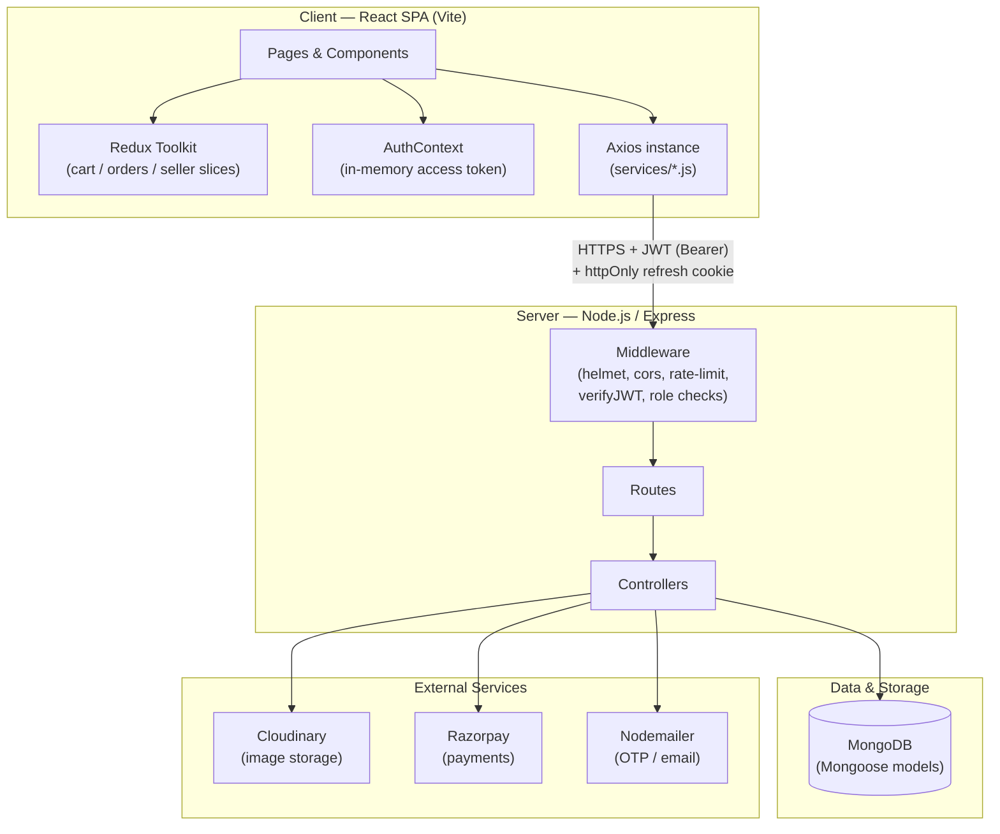
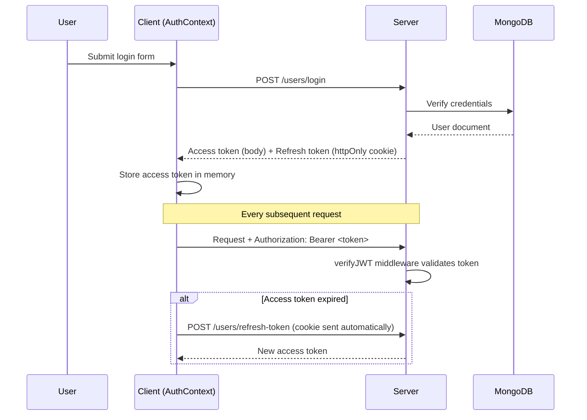
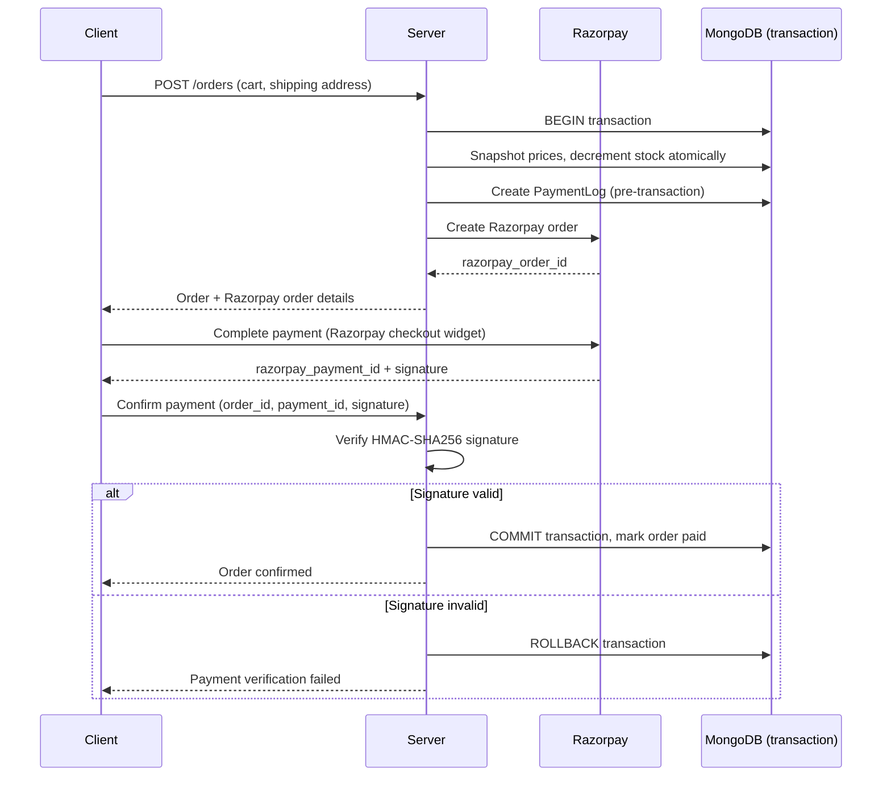
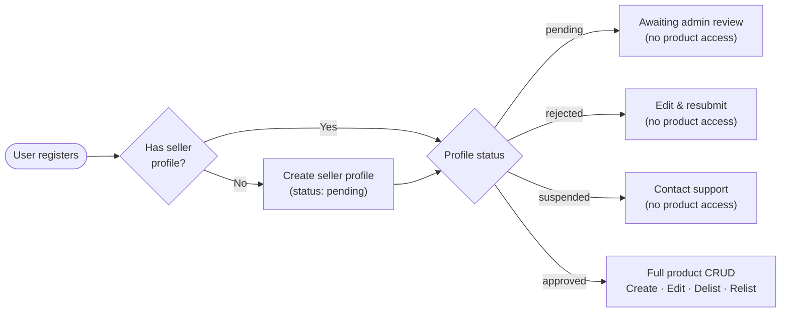

<a id="readme-top"></a>

<div align="center">

# 🌱 RootNIX

**A full-stack MERN plant marketplace connecting plant sellers with plant lovers**

[![React][React-badge]][React-url]
[![Node.js][Node-badge]][Node-url]
[![Express.js][Express-badge]][Express-url]
[![MongoDB][MongoDB-badge]][MongoDB-url]
[![Tailwind CSS][Tailwind-badge]][Tailwind-url]
[![Redux][Redux-badge]][Redux-url]

[Report Bug](https://github.com/Akshita1140/RootNIX/issues) · [Request Feature](https://github.com/Akshita1140/RootNIX/issues)

</div>

<details>
<summary>Table of Contents</summary>

1. [About The Project](#about-the-project)
2. [System Architecture](#system-architecture)
   - [High-Level Architecture](#high-level-architecture)
   - [Authentication Flow](#authentication-flow)
   - [Order & Payment Flow](#order--payment-flow)
   - [Seller Onboarding Flow](#seller-onboarding-flow)
   - [Folder Structure](#folder-structure)
3. [Features](#features)
4. [Tech Stack](#tech-stack)
5. [Getting Started](#getting-started)
   - [Prerequisites](#prerequisites)
   - [Installation](#installation)
   - [Environment Variables](#environment-variables)
   - [Running the App](#running-the-app)
6. [API Overview](#api-overview)
7. [Roadmap](#roadmap)
8. [Contributing](#contributing)
9. [License](#license)
10. [Contact](#contact)

</details>

---

## About The Project

RootNIX is a full-stack **MERN** (MongoDB, Express, React, Node.js) marketplace built for buying and selling plants. It supports two core user journeys out of the box:

- **Buyers** can browse products, manage a cart, check out, pay securely via Razorpay, and track their orders from a personal profile.
- **Sellers** can apply for a seller profile, get admin-approved, and manage their own product listings — create, edit, delist, and relist — from a dedicated seller dashboard.

The project was built incrementally, backend-first, with a strong emphasis on data integrity for money-touching flows (atomic stock decrements, price snapshotting, and verified payment signatures) before layering the UI on top.

<p align="right">(<a href="#readme-top">back to top</a>)</p>

---

## System Architecture

### High-Level Architecture



### Authentication Flow

Access tokens are kept **in memory only** on the client (never in `localStorage`), while the refresh token lives in an `httpOnly` cookie — this limits XSS blast radius for token theft.



### Order & Payment Flow

Checkout uses a MongoDB **ACID transaction** so stock decrements, price snapshotting, and payment-log creation either all succeed or all roll back together.



### Seller Onboarding Flow

Product listing is gated behind admin approval — a seller can create/edit their profile at any status, but the `requireApprovedSeller` middleware blocks product routes until `status === "approved"`.



### Folder Structure

```
RootNIX/
├── client/                       # React 19 + Vite SPA
│   └── src/
│       ├── components/           # Reusable UI (shadcn-based) + ProtectedRoute
│       ├── context/               # AuthContext (in-memory token, user state)
│       ├── pages/                 # Route-level pages
│       │   ├── auth/               # Login, Register, VerifyOtp
│       │   ├── CartPage.jsx
│       │   ├── CheckoutPage.jsx
│       │   ├── OrderConfirmationPage.jsx
│       │   ├── UserProfilePage.jsx
│       │   ├── SellerDashboardPage.jsx
│       │   └── Home.jsx
│       ├── redux/                 # Redux Toolkit slices (cart, orders, seller)
│       ├── services/              # Axios API modules (one per resource)
│       └── lib/                   # Utilities (cn, etc.)
│
├── server/                       # Node.js + Express API
│   ├── config/                    # DB connection, Cloudinary config
│   ├── constants/
│   ├── controllers/               # Business logic per resource
│   ├── middleware/                # auth, role-gating, multer, error handling
│   ├── models/                    # Mongoose schemas
│   ├── routes/                    # Express routers
│   ├── services/                  # Cross-cutting services (email, etc.)
│   ├── utils/                     # ApiResponse, ApiErrors, asyncHandler
│   └── public/uploads/            # Multer temp storage before Cloudinary upload
│
└── README.md
```

<p align="right">(<a href="#readme-top">back to top</a>)</p>

---

## Features

**Buyer**
- Browse and search live product listings
- Cart → Checkout → Razorpay Payment → Order Confirmation flow
- Personal profile: edit name/city/pincode, avatar upload, order history, logout

**Seller**
- Apply for a seller profile (shop name, description, contact, address)
- Track approval status (pending / approved / rejected / suspended)
- Once approved: create, edit, delist, and relist product listings
- Seller dashboard stats: total/active/out-of-stock products, average rating

**Platform**
- JWT access + refresh token auth with OTP email verification
- Role-based access control (`user`, `seller`, `admin`)
- Cloudinary-backed image uploads (avatars, product photos)
- ACID-safe order/payment pipeline with Razorpay signature verification

<p align="right">(<a href="#readme-top">back to top</a>)</p>

---

## Tech Stack

| Layer | Technology |
|---|---|
| Frontend | React 19, Vite, React Router, Redux Toolkit, Tailwind CSS, shadcn/ui |
| Backend | Node.js, Express 5, Mongoose 9 |
| Database | MongoDB |
| Auth | JWT (access + refresh tokens), bcryptjs |
| Payments | Razorpay |
| Media Storage | Cloudinary |
| Email | Resend |
| Security | Helmet, express-rate-limit, express-validator |

<p align="right">(<a href="#readme-top">back to top</a>)</p>

---

## Getting Started

### Prerequisites

- Node.js (v18+ recommended)
- npm
- A MongoDB instance (local or Atlas)
- Cloudinary account (for image uploads)
- Razorpay account (for payments)

### Installation

1. Clone the repo
   ```sh
   git clone https://github.com/Akshita1140/RootNIX.git
   cd RootNIX
   ```
2. Install server dependencies
   ```sh
   cd server
   npm install
   ```
3. Install client dependencies
   ```sh
   cd ../client
   npm install
   ```

### Environment Variables

Create a `.env` file in `server/`:

```env
PORT=5000
NODE_ENV=development
MONGO_URI=your_mongodb_connection_string
CORS_ORIGIN=http://localhost:5173

ACCESS_TOKEN_SECRET=your_access_token_secret
ACCESS_TOKEN_EXPIRES_IN=15m
REFRESH_TOKEN_SECRET=your_refresh_token_secret
REFRESH_TOKEN_EXPIRES_IN=7d

CLOUDINARY_CLOUD_NAME=your_cloud_name
CLOUDINARY_API_KEY=your_api_key
CLOUDINARY_API_SECRET=your_api_secret

RAZORPAY_KEY_ID=your_razorpay_key_id
RAZORPAY_KEY_SECRET=your_razorpay_key_secret

EMAIL_HOST=smtp.example.com
EMAIL_PORT=587
EMAIL_USER=your_email_user
EMAIL_PASS=your_email_password
EMAIL_FROM=RootNIX <no-reply@rootnix.com>
```

Create a `.env` file in `client/`:

```env
VITE_API_BASE_URL=http://localhost:5000/api/v1
```

> ⚠️ Make sure `CORS_ORIGIN` in the server `.env` **exactly matches** the client's origin (protocol + host + port) — a mismatch is one of the most common causes of CORS errors during local development.

### Running the App

Start the backend:
```sh
cd server
npm run dev
```

Start the frontend (in a separate terminal):
```sh
cd client
npm run dev
```

The client runs on `http://localhost:5173` by default, and proxies API calls to the server on `http://localhost:5000`.

<p align="right">(<a href="#readme-top">back to top</a>)</p>

---

## API Overview

All routes are prefixed with `/api/v1`.

| Resource | Base Path | Notes |
|---|---|---|
| Auth / Users | `/users` | Register, login, OTP verification, profile, avatar |
| Products | `/products` | Public listing/search; seller-gated create/update/delete |
| Cart | `/cart` | Authenticated cart management |
| Orders | `/orders` | Create order, fetch own order history |
| Payments | `/payments` | Razorpay order creation & signature verification |
| Sellers | `/sellers` | Seller profile CRUD, dashboard stats |

<p align="right">(<a href="#readme-top">back to top</a>)</p>

---

## Roadmap

- [x] Auth (JWT + OTP email verification)
- [x] Cart → Checkout → Payment → Order Confirmation
- [x] Seller onboarding & approval workflow
- [x] Product CRUD for approved sellers
- [x] Buyer profile with order history
- [ ] Gemini-powered plant scanner
- [ ] In-app chatbot
- [ ] Community / plant-exchange features
- [ ] Real-time messaging via WebSockets (Socket.io)

See the [open issues](https://github.com/Akshita1140/RootNIX/issues) for a full list of proposed features and known issues.

<p align="right">(<a href="#readme-top">back to top</a>)</p>

---

## Contributing

Contributions make the open-source community amazing. Any contributions are **greatly appreciated**.

1. Fork the Project
2. Create your Feature Branch (`git checkout -b feature/AmazingFeature`)
3. Commit your Changes (`git commit -m 'Add some AmazingFeature'`)
4. Push to the Branch (`git push origin feature/AmazingFeature`)
5. Open a Pull Request

<p align="right">(<a href="#readme-top">back to top</a>)</p>

---

## License

Distributed under the MIT License. See `LICENSE` for more information.

<p align="right">(<a href="#readme-top">back to top</a>)</p>

---

## Contact

Akshita — [GitHub](https://github.com/Akshita1140)

Project Link: [https://github.com/Akshita1140/RootNIX](https://github.com/Akshita1140/RootNIX)

<p align="right">(<a href="#readme-top">back to top</a>)</p>

<!-- BADGE DEFINITIONS -->
[React-badge]: https://img.shields.io/badge/React-19-20232A?style=for-the-badge&logo=react&logoColor=61DAFB
[React-url]: https://react.dev/
[Node-badge]: https://img.shields.io/badge/Node.js-18%2B-339933?style=for-the-badge&logo=node.js&logoColor=white
[Node-url]: https://nodejs.org/
[Express-badge]: https://img.shields.io/badge/Express-5-000000?style=for-the-badge&logo=express&logoColor=white
[Express-url]: https://expressjs.com/
[MongoDB-badge]: https://img.shields.io/badge/MongoDB-Mongoose-47A248?style=for-the-badge&logo=mongodb&logoColor=white
[MongoDB-url]: https://www.mongodb.com/
[Tailwind-badge]: https://img.shields.io/badge/Tailwind_CSS-4-06B6D4?style=for-the-badge&logo=tailwindcss&logoColor=white
[Tailwind-url]: https://tailwindcss.com/
[Redux-badge]: https://img.shields.io/badge/Redux_Toolkit-2-764ABC?style=for-the-badge&logo=redux&logoColor=white
[Redux-url]: https://redux-toolkit.js.org/
